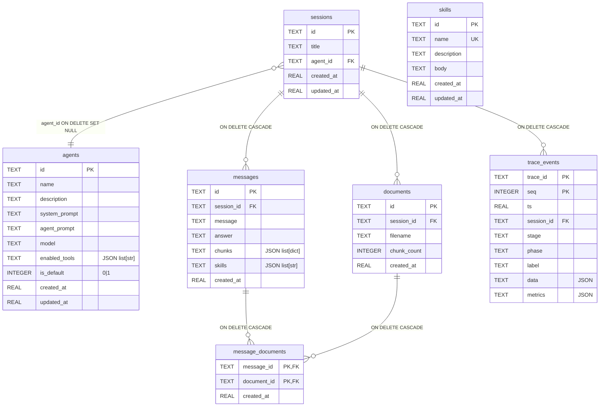

# Data model

This is the canonical schema reference for the **relational** application
store (SQLite at `backend/app/db/store.py`). For the **vector** store
(Chroma) see [`architecture.md`](architecture.md). Two databases, on
purpose — transactional app state lives here; embeddings live there.

Six tables, all owned by `ConversationStore`. The columns below match
`_SCHEMA` in `store.py` 1:1; if you change one without changing the
other, the schema-audit test (`backend/tests/test_schema_audit.py`)
fails on the next CI run with a diff-style message naming exactly what
to add or remove.

## ERD



ASCII fallback (for viewers without Mermaid):

```
                  ┌──────────┐
                  │  agents  │   ◀── catalog of agents (default + user-created)
                  └────┬─────┘
                       │ agent_id (no cascade — see "Relationships")
                       ▼
┌──────────┐      ┌───────────┐      ┌──────────────────┐
│ messages │◀────▶│ sessions  │─────▶│    documents     │
│          │ FK   │ (one chat │ FK   │ (uploaded PDFs)  │
│          │CASCD │  thread)  │CASCD │                  │
└────┬─────┘      └───────────┘      └────────┬─────────┘
     │                                          │
     │  message_documents (M..1 doc per turn)   │
     └──────────────────────────────────────────┘
                       │
                CASCADE both sides

           ┌──────────┐
           │  skills  │   ◀── global catalog (no FKs)
           └──────────┘

           ┌──────────────┐
           │ trace_events │  ◀── per-event log (FK session_id, CASCADE)
           └──────────────┘
```

## Tables

### `sessions`

A single chat thread. The frontend's session list (sidebar) is a
projection of this table ordered by `updated_at DESC`.

| column | type | null | meaning |
|---|---|---|---|
| `id` | TEXT | NO | UUID hex; primary key. |
| `title` | TEXT | YES | Lazily filled with the first message (truncated to 60). NULL until the first send. |
| `agent_id` | TEXT | YES | FK → `agents.id` with `ON DELETE SET NULL` (047). The app's `_delete_agent_sync` re-points sessions to the default first (better UX); SET NULL is the schema-level backstop for any other deletion path. |
| `created_at` | REAL | NO | Unix epoch seconds. |
| `updated_at` | REAL | NO | Bumped on every write (drives recent-first ordering). |

### `agents`

The Lumis-style shared agent catalog (044-shared-agent-catalog). One
default ("Agent Simulator") is always present and cannot be deleted;
the user can create more via the catalog UI. **One agent backs many
sessions** — editing an agent propagates to every conversation using it.

| column | type | null | meaning |
|---|---|---|---|
| `id` | TEXT | NO | UUID hex (or `agent-simulator-default` for the seed). |
| `name` | TEXT | NO | User-visible display name; ≤60 chars. |
| `description` | TEXT | NO | One-line catalog blurb; ≤240 chars. Defaults to `''`. |
| `system_prompt` | TEXT | NO | The "guardrails" layer (top of the composed system prompt). |
| `agent_prompt` | TEXT | NO | The "role" layer (composed below `system_prompt`). |
| `model` | TEXT | NO | OpenAI model id; validated against the curated allowlist in `llm/models.py`. |
| `enabled_tools` | TEXT | NO | JSON list of MCP tool names. `[]` = no tools (tools are CODE in `mcp/server.py`; this is just a name-filter). |
| `is_default` | INTEGER | NO | `0` or `1`, enforced by `CHECK (is_default IN (0, 1))` (047). Exactly one row has `1`. |
| `created_at` | REAL | NO | Unix epoch seconds. |
| `updated_at` | REAL | NO | Bumped on every `update_agent`. |

Indexed: `idx_agents_is_default` on `(is_default)`.

### `messages`

Append-only turn log. Each row is one user message + the assistant's
answer in the same SQL row — a turn is the unit, not the half-turn.

| column | type | null | meaning |
|---|---|---|---|
| `id` | TEXT | NO | UUID hex; primary key. Turns are immutable: a duplicate id raises `sqlite3.IntegrityError` (047 dropped the previous `INSERT OR REPLACE`, which could orphan join rows). |
| `session_id` | TEXT | NO | FK → `sessions.id` (CASCADE). |
| `message` | TEXT | NO | The user's text. |
| `answer` | TEXT | NO | The assistant's final answer. |
| `chunks` | TEXT | NO | JSON list of `{text, score, source, …}`; the RAG hits the agent saw for this turn (replay source). Defaults to `'[]'`. |
| `skills` | TEXT | NO | JSON list of skill names loaded this turn (027-skills). Defaults to `'[]'`. |
| `created_at` | REAL | NO | Unix epoch seconds. |

Indexed: `idx_messages_session` on `(session_id, created_at)` for the
read-history query path.

### `documents`

One row per uploaded PDF (or other ingested file). The actual chunks
live in the Chroma vector store under `metadata.document_id`; this
relational row is the "label / counter / FK anchor".

| column | type | null | meaning |
|---|---|---|---|
| `id` | TEXT | NO | UUID hex. |
| `session_id` | TEXT | NO | FK → `sessions.id` (CASCADE). Uploads belong to one session. |
| `filename` | TEXT | NO | Original filename for display. |
| `chunk_count` | INTEGER | NO | How many vector chunks this PDF produced. `CHECK (chunk_count >= 0)` (047); zero is allowed for an empty doc. |
| `created_at` | REAL | NO | Unix epoch seconds. |

Indexed: `idx_documents_session` on `(session_id, created_at)`.

### `message_documents`

Join table (040-message-attachments): pins an uploaded document to the
specific turn that introduced it via the composer chip. The agent's
retrieval still queries vectors by session, so this join is purely a
UI/audit affordance — it lets the user bubble's attachment chip travel
with the right message instead of staying sticky in the composer.

| column | type | null | meaning |
|---|---|---|---|
| `message_id` | TEXT | NO | FK → `messages.id` (CASCADE). Part of composite PK. |
| `document_id` | TEXT | NO | FK → `documents.id` (CASCADE). Part of composite PK. |
| `created_at` | REAL | NO | Unix epoch seconds. |

PK: `(message_id, document_id)`. Indexed:
`idx_message_documents_message`, `idx_message_documents_document`.

A document is linked to **at most one** message (the turn that
introduced it). The write path in `_write_message_sync` enforces this
explicitly; the PK is belt-and-braces against same-message duplicates.

### `skills`

The global, agent-loadable skill catalog (027-skills). A skill is a
named instruction bundle the agent advertises by `(name, description)`
and loads on demand (`body`) via the `load_skill` MCP tool. Independent
of sessions (truly global).

| column | type | null | meaning |
|---|---|---|---|
| `id` | TEXT | NO | UUID hex. |
| `name` | TEXT | NO | **UNIQUE** — the model references the skill by this string. |
| `description` | TEXT | NO | One-line summary the model sees in `mcp.discover`. |
| `body` | TEXT | NO | The instructions the agent receives when it calls `load_skill(name)`. |
| `created_at` | REAL | NO | Unix epoch seconds. |
| `updated_at` | REAL | NO | Bumped on edit. |

### `trace_events`

Every `TraceEvent` emitted during a chat or upload (048-persist-traces).
Denormalized single table — `session_id` rides on every row for cheap
per-session reads; `message_id` is not stored because `message_id ==
trace_id` by construction (the chat endpoint reuses `trace_id` when
calling `write_message` at end of run). The in-memory `TraceStore`
(`backend/app/trace.py`, LRU=50) still sits in front as a hot cache; on
miss, `GET /api/trace/{id}` reconstructs the `TraceSummary` from here.

| column | type | null | meaning |
|---|---|---|---|
| `trace_id` | TEXT | NO | UUID hex; part of composite PK. Equals the `messages.id` of the persisted turn (when one was written). |
| `seq` | INTEGER | NO | Monotonic 1..N within the trace; part of composite PK. |
| `ts` | REAL | NO | Unix epoch seconds at emit time. |
| `session_id` | TEXT | YES | FK → `sessions.id` (CASCADE). Nullable for the brief window before the chat/upload endpoint adopts the session on the emitter. |
| `stage` | TEXT | NO | The `Stage` enum value (e.g. `backend`, `rag.search`, `llm.generate`). |
| `phase` | TEXT | NO | The `Phase` enum value (`start` \| `progress` \| `end`). |
| `label` | TEXT | NO | Short human-readable description shown in the canvas. Defaults to `''`. |
| `data` | TEXT | NO | JSON blob (`json.dumps(default=str)` — unusual objects like `Path` coerce to strings). Defaults to `'{}'`. |
| `metrics` | TEXT | NO | JSON map of numeric metrics (`latency_ms`, `prompt_tokens`, …). Defaults to `'{}'`. |

PK: `(trace_id, seq)`. Index `idx_trace_events_session` on
`(session_id, ts)` for the per-session lookup path. Writes go through
`TraceEmitter.emit` → `_persist` → `ConversationStore.write_trace_event`
in real time (one INSERT per event, via `asyncio.to_thread`); persist
failures are logged and swallowed so the SSE stream is never starved.

## Relationships + cascade rules

| Parent | Child | Cascade |
|---|---|---|
| `sessions` | `messages` | **CASCADE** — deleting a session removes its turns. |
| `sessions` | `documents` | **CASCADE** — deleting a session removes its uploaded docs. |
| `messages` | `message_documents` | **CASCADE** — deleting a turn removes its attachment links. |
| `documents` | `message_documents` | **CASCADE** — deleting a doc removes its links. |
| `agents` | `sessions` | **`ON DELETE SET NULL`** (047). The app's `_delete_agent_sync` still re-points sessions to the default agent explicitly (the better UX); SET NULL is the schema-level backstop for any other deletion path (raw SQL, future endpoint, fixture). |
| `sessions` | `trace_events` | **CASCADE** (048) — deleting a session removes every persisted trace event for that conversation. |

`PRAGMA foreign_keys = ON` is set per connection (off by default in
SQLite) — see `ConversationStore._connect`.

## What's NOT a table

A handful of things look like they could be database tables but aren't,
on purpose:

- **Tools.** Tools are MCP **code** (`backend/app/mcp/server.py`:
  `calculator`, `current_time`, `kb_lookup`, `load_skill`). There is no
  `tools` table. `agents.enabled_tools` is just a JSON list of *names*
  — it's a per-agent allowlist, not a persisted tool definition.
  Promoting tools into a real table would be a much bigger spec
  (versioning + sandbox + UI) and isn't on the roadmap.
- **Configs.** App configuration lives in **environment variables**
  (read via pydantic `Settings` in `app/config.py`) and **browser
  localStorage** (frontend stores: `useCloud`, `useLang`, `useScenario`,
  `useExperiment`, `onboarding` flag…). There is no `configs` table.
  The visualizer's settings are deliberately client-side so the demo
  state is per-browser, not shared across visitors.
- **Vector chunks.** RAG vectors live in **Chroma** (`backend/data/chroma/`),
  not in SQLite. The `documents` row is just the relational counter;
  the chunks are in the `ai_engineering` collection with
  `metadata = {corpus: True/False, session_id, document_id, …}`.
  See `app/rag/`.
- **Object storage.** Uploaded files' bytes live in
  `app/object_store.py` (a real on-disk store in dev, swappable for S3
  / Azure Blob / GCS in production). The `documents` row records the
  *filename* + *chunk count*; the bytes go to the object store; the
  vectors go to Chroma. Three stores, three jobs.
- **Schema migrations history.** Today's migration metadata is a single
  `PRAGMA user_version` integer:
  - `0` — pre-044 dev DB (lightweight column-add migrations run on every boot).
  - `1` — post-044 (shared-agent-catalog one-shot done; 043 clones dropped).
  - `2` — post-047 (per-table rebuild for `ON DELETE SET NULL` + `CHECK`
    constraints done; orphan `message_documents` swept).
  - `3` — post-048 (`trace_events` table added; pure additive `CREATE
    TABLE IF NOT EXISTS`, no row rebuild).
  A real `schema_migrations` table is deferred to a future spec — the
  current set fits on one hand and the version pragma is cheap.

## How `clear_all` wipes everything

`POST /api/data/clear` calls `ConversationStore.clear_all()` which:

1. Counts every user-data table, then deletes them in this order:
   `trace_events → documents → messages → sessions → skills → agents`.
   The session-rooted cascades make most of this redundant, but the
   explicit deletes mean the wipe is total even if a future change
   ever disables `PRAGMA foreign_keys`.
2. Re-seeds the default agent (`_seed_default_agent_sync`) so the next
   `create_session` works without a server restart.
3. Returns a dict with one `<table>_deleted` integer per top-level user
   table:
   `{sessions_deleted, messages_deleted, documents_deleted, skills_deleted, agents_deleted, trace_events_deleted}`.

`message_documents` is implicit via cascade — its emptiness is asserted
in `test_clear_coverage.py` directly via `SELECT COUNT(*)` rather than
a reported count key.

On the HTTP side `POST /api/data/clear` adds two more counts from
non-relational stores:

- `vectors_removed` — user-imported vectors dropped via
  `delete_uploaded_vectors()` (the built-in corpus is preserved).
- `objects_deleted` — uploaded files removed from the object store via
  `clear_objects()`.

## Adding or changing a table

When the schema changes, update **three** places in the same PR:

1. `_SCHEMA` in `backend/app/db/store.py`.
2. This document — both the ERD and the table reference.
3. The two pinned constants in `backend/tests/`:
   - `EXPECTED_TABLES` in `test_schema_audit.py` (every user table).
   - `EXPECTED_CLEAR_KEYS` in `test_clear_coverage.py` (every
     `<table>_deleted` count `clear_all` reports).

Either of the two test files will fail loudly with a diff-style
message if you forget one of these — that's the whole point of 046.
